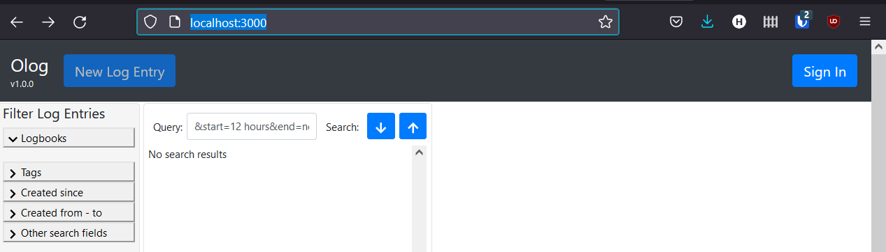

Install as normal user
=========================================

.. contents:: Contents

This is how I installed phoebus-olog and phoebus-olog-web-client into my
home directory, without any elevated privleges. The server in question
is CentOS 7. The physics department "owns" the virtual machine, but
doesn't have admin access.

There is a set of instructions at
https://github.com/Olog/phoebus-olog/blob/master/README.md but they're a
little vague in places, and assume that you have a clue. I am fresh out
of clues.

Local packages
--------------

1. Open JDK 11 (version 17 does not work)
2. Elastic version 6.8.4
3. Mongodb
4. Maven
5. node

Prep
~~~~

I created ``~/EPICS/downloads`` to store all the tarballs. Once
downloaded, I extracted the files under the EPICS directory
``tar -xf ~/EPICS/downloads/something.tar.xz``.

All downloads were performed using ``curl -O`` from within the downloads
folder.

Create ``var/`` and ``etc/`` directories inside of your working folder
before you get started.

JDK
~~~

I got OpenJDK 11 from https://jdk.java.net/archive/. I first tried with
17, because ``README.md`` suggested "or newer" but newer didn't work.
Rather than go through trial and error to find the newest version that
worked, I grabbed 11. It is unlikely that a newer 11 will be released,
so download it from:
https://download.java.net/java/GA/jdk11/9/GPL/openjdk-11.0.2\_linux-x64\_bin.tar.gz

Unpack from ~/EPICS/ by running

.. code-block:: bash

  tar -xf downloads/openjdk-11.0.2_linux-x64_bin.tar.gz

Now add JAVA\_HOME and extend path. I added the following to
``~/.bashrc``

.. code-block:: bash

    export JAVA_HOME=/home/leblanc/EPICS/jdk-11.0.2
    export PATH=/home/leblanc/EPICS/jdk-11.0.2/bin:$PATH

Then imported ``.bashrc``:

.. code-block:: bash

    source ~/.bashrc

Test to make sure java is working:

.. code-block:: bash

    java --version

Elastic
~~~~~~~

I didn't even bother trying a newer version of this, since a link to
6-8-4 was already provided.

Grab the tarball from:
https://www.elastic.co/downloads/past-releases/elasticsearch-6-8-4
Direct link:
https://artifacts.elastic.co/downloads/elasticsearch/elasticsearch-6.8.4.tar.gz

Unpack with:

.. code-block:: bash

    tar -xf downloads/elasticsearch-6.8.4.tar.gz

Update path again:

.. code-block:: bash

    export PATH=/home/leblanc/EPICS/elasticsearch-6.8.4/bin:$PATH

Next, edit config/elasticsearch.yml

Run elasticsearch as a daemon, and with a PID file.:

.. code-block:: bash

    elasticsearch -d -p /home/leblanc/EPICS/var/elastic.pid

Next, test with:

.. code-block:: bash

    curl -X GET http://localhost:9200/

It should return a mess that looks something like:

.. code-block:: bash

    {
      "name" : "Q3ELjc_",
      "cluster_name" : "elasticsearch",
      "cluster_uuid" : "3H8viOGxS4KCLP4cQv2unQ",
      "version" : {
        "number" : "6.8.4",
        "build_flavor" : "default",
        "build_type" : "tar",
        "build_hash" : "bca0c8d",
        "build_date" : "2019-10-16T06:19:49.319352Z",
        "build_snapshot" : false,
        "lucene_version" : "7.7.2",
        "minimum_wire_compatibility_version" : "5.6.0",
        "minimum_index_compatibility_version" : "5.0.0"
      },
      "tagline" : "You Know, for Search"
    }

mongodb
~~~~~~~

This one seems to work with the newest version which can be downloaded
from: https://www.mongodb.com/try/download/community On the sidebar,
select Platform as RedHat / CentOS 7.0, and package as tgz.

This one requires slightly more fiddling to make work. Since we don't
have access to /, we have to move things around. Create a directory
``~/EPICS/etc/`` and create ``mongodb.conf`` with the following:

.. code-block:: bash

    processManagement:
       fork: true
    net:
       bindIp: localhost
       port: 27017
    storage:
       dbPath: /home/leblanc/EPICS/mongodb-data
    systemLog:
       destination: file
       path: "/home/leblanc/EPICS/var/mongod.log"
       logAppend: true
    storage:
       journal:
          enabled: true

Update your path with:

.. code-block:: bash

    export PATH=/home/leblanc/EPICS/mongodb-linux-x86_64-rhel70-5.0.3/bin:$PATH

Next crete the directory ``/home/leblanc/EPICS/mongodb-data``. Start
mongodb with:

.. code-block:: bash

    mongod -f /home/leblanc/EPICS/etc/mongod.conf

Maven
~~~~~

I grabbed the latest maven from: https://maven.apache.org/download.cgi

Unpack with:

.. code-block:: bash

    https://maven.apache.org/download.cgi

Update path:

.. code-block:: bash

    export PATH=/home/leblanc/EPICS/apache-maven-3.8.3/bin:$PATH

Test:

.. code-block:: bash

    mvn --version

Should return:

.. code-block:: bash

    Apache Maven 3.8.3 (ff8e977a158738155dc465c6a97ffaf31982d739)
    Maven home: /home/leblanc/EPICS/apache-maven-3.8.3
    Java version: 11.0.2, vendor: Oracle Corporation, runtime: /home/leblanc/EPICS/jdk-11.0.2
    Default locale: en_US, platform encoding: UTF-8
    OS name: "linux", version: "3.10.0-1160.42.2.el7.x86_64", arch: "amd64", family: "unix"

Node
~~~~

Grab the latest node from: https://nodejs.org/en/download/. Update path:

.. code-block:: bash

    export PATH=/home/leblanc/EPICS/node-v14.18.1-linux-x64/bin:$PATH

--------------

phoebus-olog
------------

Now that the tools are all in place, we can work on Olog. Get everything
from git with:

.. code-block:: bash

    git clone --depth=1 https://github.com/Olog/phoebus-olog.git

Build with:

.. code-block:: bash

    mvn clean install

Run with:

.. code-block:: bash

    mvn org.springframework.boot:spring-boot-maven-plugin:run

Now test with:

.. code-block:: bash

    curl -X GET http://localhost:8080/Olog

Which should return something like:

.. code-block:: bash

    {
      "name" : "Olog Service",
      "version" : "1.0.0",
      "elastic" : {
        "status" : "Connected",
        "clusterName" : "elasticsearch",
        "clusterUuid" : "3H8viOGxS4KCLP4cQv2unQ",
        "version" : "6.8.4"
      },
      "mongo-gridfs" : {
        "status" : "Connected",
        "mongo" : "{type=STANDALONE, servers=[{address=localhost:27017, type=STANDALONE, roundTripTime=1.6 ms, state=CONNECTED}]"
      }
    }

phoebus-olog-web-client
-----------------------

Similar story to what we did for olog:

.. code-block:: bash

    git clone --depth=1 https://github.com/Olog/phoebus-olog-web-client.git

Now run the commands from their ``README.md``:

.. code-block:: bash

    npm install

Create the .env file:

.. code-block:: bash

    cat > .env << EOF
    REACT_APP_BASE_URL='http://localhost:8080/Olog'
    EOF

Start the Olog-ED backend.

.. code-block:: bash

    npm start

At this point, the web application is too complex to test using curl
(javascript and the like). In order to enable testing from my desktop, I
configured ssh port forwarding, using the following in ~/.ssh/config:

.. code-block:: bash

    host theServer
        HostName theServer.Somewhere.org
        User leblanc
        LocalForward 3000 localhost:3000
        LocalForward 5000 localhost:5000
        LocalForward 8080 localhost:8080

Now once I establish an ssh connection to theServer, I can point my
local web browser to http://localhost:3000/ and get the following page:

   olog screenshot

Another handy page that I you can get is at
http://localhost:8080/CommonmarkCheatsheet.html

This has information on markdown, which you can use to beautify your log
entries.
